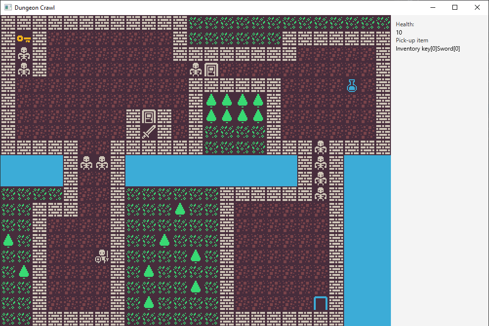
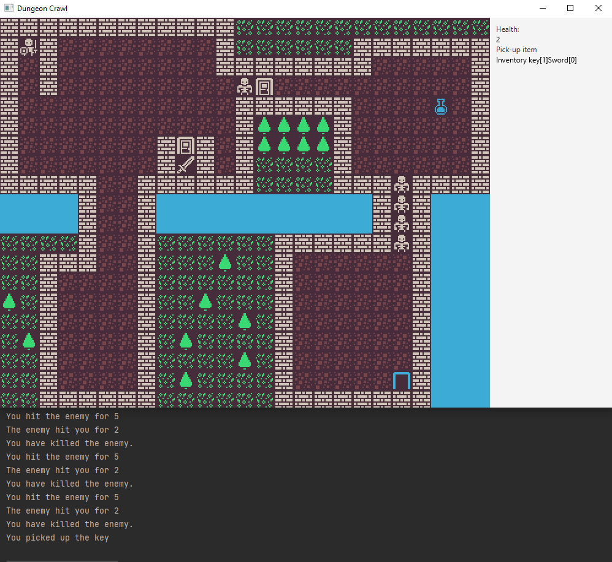

# DungeonCrawl
It’s time to go back in time and design a brand new roguelike game inspired by old school games.
We all miss those simpler times so we decided to bring back the joy of those good old days.

## Fun fact
Roguelikes are the oldest types of video games, the earliest ones were made in the 70s,they were inspired a lot by the tabletop RPGS

  

  

## How it works
Dungeon Crawl is a game where you, 
the player, need to defeat the monsters and escape, through getting items scattered around the map. 

